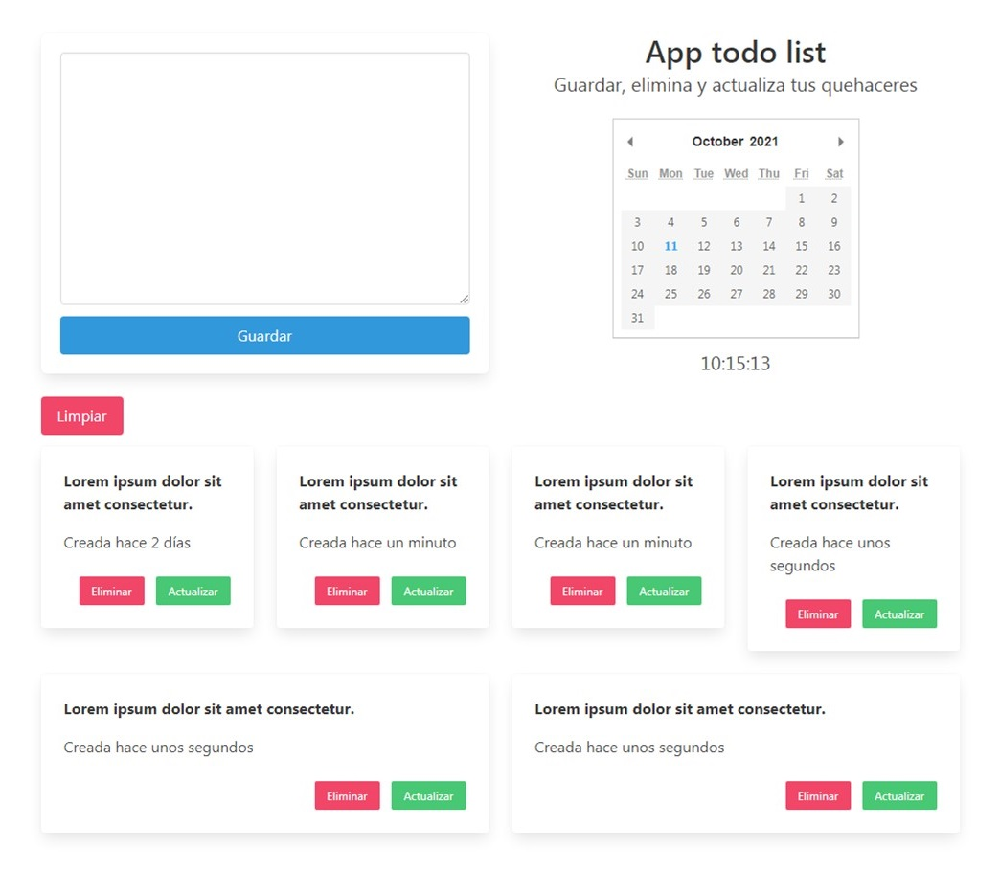

## APP TODO LIST
Aplicación web simple con Api rest en Golang y cliente con Vue 

## Objetivo
* Practicar con el lenguaje de programación Go y el framework Vue
* Crear una aplicación web simple sin frameworks, ni ORM del lado del servidor 

## Descripción
* Backend desarrollado con Golang
* Frontend desarrollado con VueJs, las librerías moment, sweetalert, pikaday, axios y estilizado con bulma.css

## Estructura del proyecto
```
go-todo-list
├── public
│   ├── static
│   │   └── ...             // Archivos estáticos 
│   └── tamplates
│       └── index.html      // Plantilla para el cliente
├── schema
│   └── task_schema         // Código SQL
└── serve.go                // Contiene la lógica de la app
```

## Recursos
```
Methods            Route
------------------ ------------------------
GET                /
DELETE, GET, PUT   /api/v1/task/
GET, POST, DELETE  /api/v1/tasks/
```

## Vista previa

